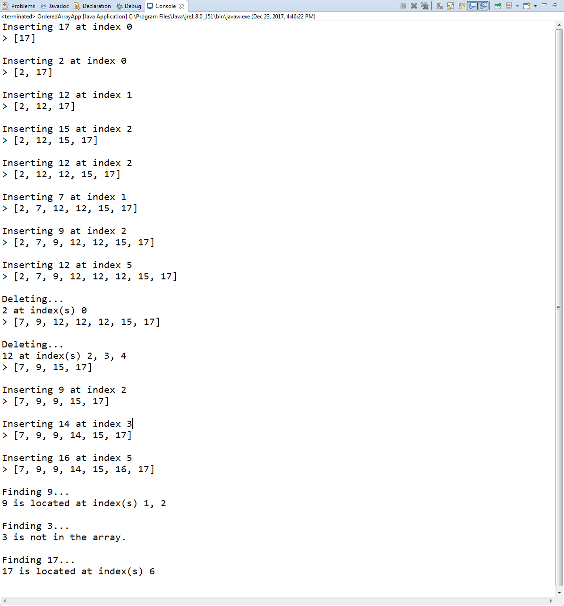

# Ordered Arrays in Java 
This is an ordered array data structure implemented in Java. However, it is not your typical ordered array implementation because it boasts handling for duplicates as well as employs binary search for its insert, delete, and find methods. The insertion maximizes reducing shifting of elements when inserting duplicate values.

## Algorithmic efficiency
* Searching using binary search operates at an order of log n.
* Deletion (binary search) requires shifting elements to remove an item to fill in the empty cell, therefore operates at O(n).
* Insertion with duplicates (binary search) also requires shifting elements to properly insert an element into a position to persevere ordering, O(n). Note that unordered array insertion operates at a constant time which is ideal O(1).

## Screenshot(s)

## Built with
* Java version "1.8.0_151"
* Java(TM) SE Runtime Environment (build 1.8.0_151-b12)
* Java HotSpot(TM) 64-Bit Server VM (build 25.151-b12, mixed mode)
* Eclipse Oxygen Release (4.7.1a)

## Author
* **Jarid Bredemeier**

## License
Apache license 2.0